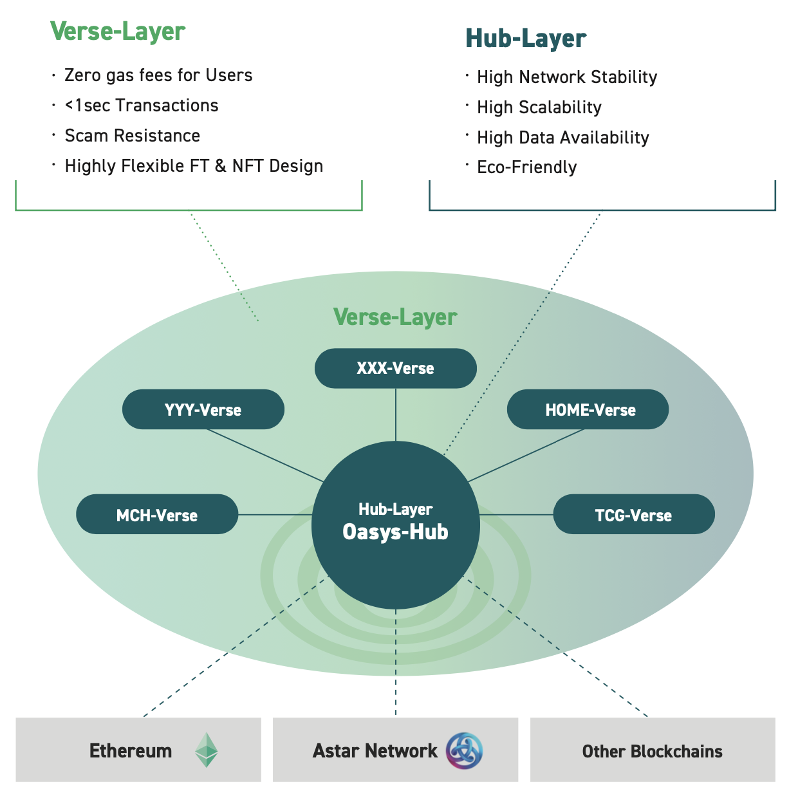

# Introduction

What is TCG Verse

[TCG Verse](https://tcgverse.xyz/) is [Oasys](https://www.oasys.games/)' L2(Layer2) blockchain specializing in Trading Card Games.\
Web：[https://tcgverse.xyz/](https://tcgverse.xyz/)\
Twitter：[https://twitter.com/tcgverse](https://twitter.com/tcgverse)

・Introduction Oasys

Oasys is a public blockchain specializing in games. It is launching with support from renowned game companies to revolutionize "Blockchain for The Games."

Oasys is an EVM-Compatible protocol that adopts the Oasys Architecture. This unique architecture consists of a multi-layered structure: Hub-Layer, a highly scalable Layer 1; and Verse-Layer, a special Layer 2 using Ethereum's Layer 2 scaling solution.

Oasys Architecture is built for game developers, offering a high-speed, zero gas fee experience to users by combining the best of public L1 and private L2 blockchain technology solutions.CryptoGames participates in Oasys chain development and validators.

Web：[https://www.oasys.games/](https://www.oasys.games/)\
Oasys Hub：[https://hub.oasys.games/](https://hub.oasys.games/)\
Twitter：[https://twitter.com/oasys\_games](https://twitter.com/oasys\_games)

＜日本語訳＞\
「TCG Verse」はTrading Card Games）に特化したOasysのL2（レイヤー２）のブロックチェーンです

・Oasysの紹介

Oasys はゲーム開発者向けに構築されており、パブリック L1 およびプライベート L2 ブロックチェーン テクノロジ ソリューションの組み合わせにより、ユーザーは高速且つガス料金無料でゲームを楽しむことが可能です。CryptoGamesはOasysのチェーンの開発とバリデーターを務めています。



## Vision

Your cards will become your assets.

We will use blockchain to democratize card games. By operating a semi-permanently sustainable card game, we aim to create a world where cards are assets.

\
＜日本語訳＞\
私たちはブロックチェーンを使い、カードゲームを民主化することに挑戦します。半永久的にサステナブルなカードゲームを運営することにより「カードが資産になる世界」を目指します。

<figure><figcaption></figcaption></figure>

### What is TCG1.0

These are analog-based trading card games. According to a report by the Japan Toy Association, the market size in Japan is estimated to be 122.4 billion yen in FY2020 and 178.2 billion yen in FY2021, representing a 146% growth rate from 2020 to 2021.&#x20;

＞The biggest factor behind the record-high toy market size in FY2021 since the start of the study was the rapid growth of card games and trading cards, which grew by 145.6% or 55.8 billion yen in value compared to the previous fiscal year. Pokémon Card Game, Yu-Gi-Oh! OCG, and Duel Masters TCG led the market, all achieving significant growth. In particular, "Pokémon Card Game" continued to be extremely popular as in the previous year, with a continuing shortage of products. The breakthrough of card games and trading cards can be attributed to the fact that they have become a two-generation type of game 20 to 25 years after their launch, the expansion of the target age range due to the addition of location-based game applications for smartphones and distributed games, and the broadening of the base of purchasers by attracting new users, in addition to the high price of rare cards. In addition, the number of purchasers is expanding as new users are attracted to the market, and the high price of rare cards is a hot topic.&#x20;

[https://www.toys.or.jp/pdf/2022/2021\_data\_zenpan.pdf](https://www.toys.or.jp/pdf/2022/2021\_data\_zenpan.pdf)

Card planning and issuance, as well as game rules, are determined and enforced centrally by the management. The game cannot be played without obtaining or purchasing cards and cannot be started immediately. In addition, playing the game requires finding a partner offline, which is considered a high hurdle to participation. On the other hand, purchased cards become the user's assets and can be freely traded, rented, etc.

＜日本語訳＞\
TCG1.0は、アナログをベースにしたトレーディングカードゲームです。一般社団法人日本玩具協会のレポートによると日本では2020年度1224億円、2021年度1782億円の市場規模が想定され、2020vs2021で146%の成長をしています。

＞2021年度の商品動向 　2021年度の玩具市場規模が、調査開始以来、過去最高を記録した最大の要因は、前年度比145.6％、金額にして558億円の伸びを示したカードゲーム・トレーディングカードの躍進です。「ポケモンカードゲーム」、「遊戯王OCG」、「デュエル・マスターズTCG」の3強が市場を牽引し、いずれも大きな伸びを達成しました。特に「ポケモンカードゲーム」は前年に引き続き大変な人気を集め、品薄状態が続きました。カードゲーム・トレーディングカードの躍進は、いずれも発売開始から20～25年が経って2世代型の遊びになっていることに加え、スマホ向け位置情報ゲームアプリや、配信ゲームなどが加わったことによる対象年齢の拡大と、新規ユーザーの獲得によって購入者の裾野が広がっていること、さらにレアカードの高額取引などの話題性によるものです。

[https://www.toys.or.jp/pdf/2022/2021\_data\_zenpan.pdf](https://www.toys.or.jp/pdf/2022/2021\_data\_zenpan.pdf)

カードの企画と発行、及びゲームのルールは運営が中央集権的に決定及び執行を行います。カードを入手・購入しなければゲームをプレイすることができないため、すぐに開始することはできません。また、ゲームのプレイにはオフラインでパートナーを探す必要があり参加ハードルが高いと考えれられます。他方で、購入したカードはユーザーの資産となり、自由にトレード、レンタル等が可能です。

### What is TCG2.0

TCG2.0 is a digital-based trading card game.&#x20;

Hearthstone, operated by Blizzard, is a world-renowned digital card game, the service was released in March 2014, and in November 2018, the number of players worldwide surpassed 100 million.It is available not only on PC, but also on iOS, Android, and the Amazon App Store The game can be played anytime, anywhere, as long as you have a smartphone.&#x20;

Card planning and issuance, as well as game rules, are centrally determined and enforced by the management. The data of cards purchased in the game is on the developer's servers, and users cannot freely trade them, and the data will be lost when the service ends.

<figure><figcaption></figcaption></figure>

[https://www.statista.com/statistics/323239/number-gamers-hearthstone-heroes-warcraft-worldwide/](https://www.statista.com/statistics/323239/number-gamers-hearthstone-heroes-warcraft-worldwide/)

＜日本語訳＞\
TCG2.0は、デジタルをベースにしたトレーディングカードゲームです。

Blizzard社が運営する「ハースストーンは世界的に有名なデジタルカードゲームで、2014年3月にサービスがリリースし、2018年11月には全世界でプレイヤーの数が1億人を突破しました。PC版だけでなくiOSやAndroid、Amazonアプリストアでも配信され、スマートフォンさえあればいつでもどこでも遊ぶことができます。

カードの企画と発行、及びゲームのルールは運営が中央集権的に決定及び執行を行います。ゲーム内で購入したカードのデータは開発会社のサーバー上にあり、ユーザーは自由にトレードは行うことができず、サービスが終了するとデータは消えてしまいます。

### What is TCG3.0

TCG3.0 is a trading card game based on the blockchain.

With cards being NFT, cards purchased by users become assets and can be freely traded, rented, etc. In addition, taking advantage of online gaming, users can start anywhere and find a partner online to play against. In addition, by providing non-NFT cards, users can start the game for free. While the planning and issuance of cards and the rules of the game may be decided and enforced centrally by the management, some games aim to be de-centralized DAOs, with users issuing cards and users making rule changes through governance voting.&#x20;

CryptoSpells, released in Japan in June 2019, allows users to issue their own cards and users change the strength of the cards through governance voting.&#x20;

By aiming for a decentralized DAO, even if the game's developer stops issuing new cards and other operations, users can continue to operate the game on a semi-permanent basis changing the game environment. In addition, using the blockchain mechanism, such as revenue from secondary distribution fees of NFTs, server fees could be generated sustainably.

<figure><figcaption></figcaption></figure>

＜日本語訳＞\
TCG3.0はブロックチェーンをベースにしたトレーディングカードゲームです。\
カードがNFTとなっていることでユーザーが購入したカードは資産となり、自由にトレードやレンタル等を行うことができます。また、オンラインゲームの利点を活かし、ユーザーはどこでも開始することができ、オンライン上で対戦パートナーを探すことが可能です。また、NFTではないカードを用意することで、ユーザーは無料でゲームを開始できます。

カードの企画と発行、及びゲームのルールは運営が中央集権的に決定及び執行を行うこともありますが、ゲームによってはユーザーがカードを発行を行い、ユーザーがガバナンス投票によってルール変更を行うなど、非中央集権的なDAOを目指しているゲームも存在します。

日本で2019年6月にリリースした「CryptoSpells」は、ユーザーが自分でカードを発行し、ユーザーがガバナンス投票によってカードの強さを変更します。

非中央集権的なDAOを目指すことで、仮にゲームの開発会社が新規のカード発行等の運営を停止しても、半永久的にユーザーがゲームの環境を変える運営を継続していくことが可能です。また、NFTの二次流通手数料による収益等ブロックチェーンの仕組みを使うことで、サーバー代をサステナブルに捻出できる可能性があります。

## Ecosystem

<figure><figcaption></figcaption></figure>

## Roadmap

TCG Verse will support 50 of our games and partner games by 2025.\
\
June 2019：CryptoSpells released\
June 2022：TCG Verse released & supported CryptoSpells\
July 2022 ：NFTWars Alpha released\
December 2022：Oasys L1 mainnet launch\
2023： CEX listing、15 games supported\
2025：50 games supported

\
＜日本語訳＞\
TCG Verse は、2025 年までに50のゲームのサポートを計画しています。

2019年6月：CryptoSpellsリリース\
2022年6月：TCG Verseメインネットローンチ ＆CryptoSpellsがTCG Verseに対応\
2022年7月：NFTWars αリリース\
2022年12月：Oasys L1 メインネットローンチ\
2023年： 暗号資産取引所への上場、15ゲームがTCG Verseに対応\
2025年：50ゲームがTCG Verseに対応

<figure><figcaption></figcaption></figure>
