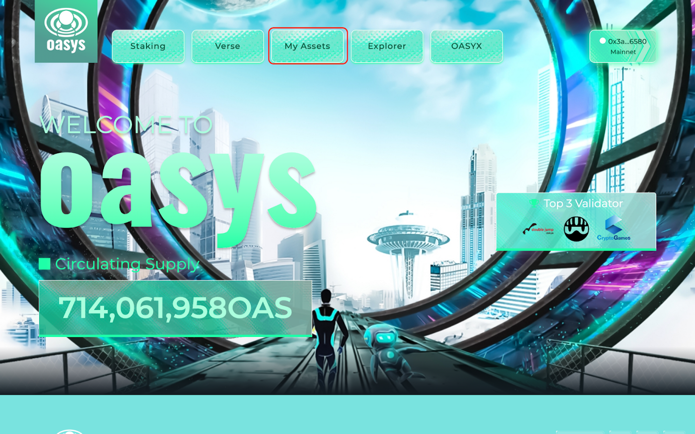
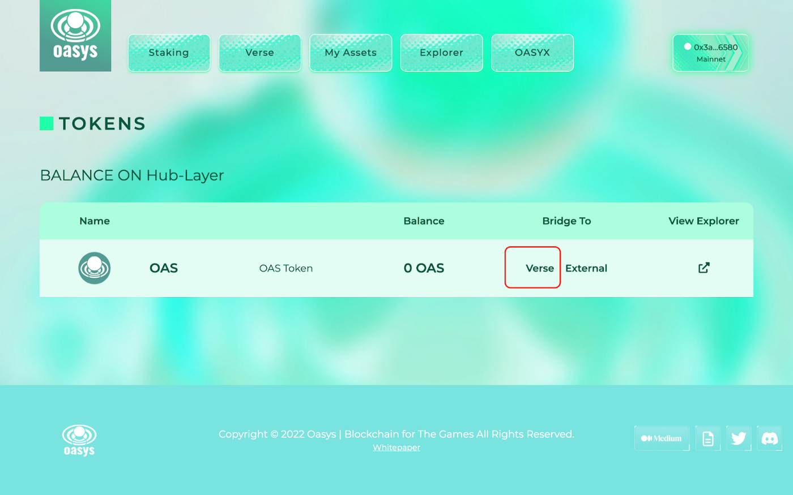
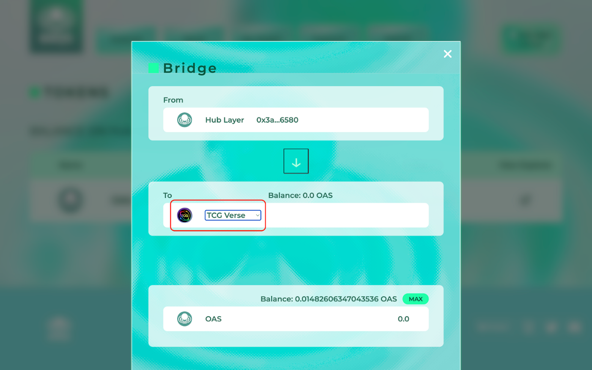

# How to bridge OAS from L1 to L2 on Oasys hub

Step１: Connect your wallet to Oasys Hub and select My Assets.



<figure><figcaption></figcaption></figure>

Step 2： Select Verse from Bridge To.

<figure><figcaption></figcaption></figure>

Step３：Select TCG Verse and bridge required amount of OAS from Hub Layer to TCG Verse.

<figure><figcaption></figcaption></figure>

Step４：Connect your wallet to Zaif INO and purchase.\
\
You can check the OAS balance you have in TCG Verse on L2 by entering your wallet address in the TCG Verse Explorer below.



You can also access TCG Verse Explorer from the top page of TCG Verse.



<figure><figcaption></figcaption></figure>
